# 📐 Especificaciones de Diseño - Dashboard Absentismo Laboral
**Versión:** 1.0  
**Fecha:** 29-11-2024  
**Estado:** BORRADOR - PENDIENTE VALIDACIÓN

---

## 📋 ÍNDICE
1. [Inventario de Assets](#1-inventario-de-assets)
2. [Tokens de Diseño Extraídos](#2-tokens-de-diseño-extraídos)
3. [Especificaciones de Componentes](#3-especificaciones-de-componentes)
4. [Mapeo Figma → Streamlit](#4-mapeo-figma--streamlit)
5. [Arquitectura CSS](#5-arquitectura-css)
6. [Plan de Implementación](#6-plan-de-implementación)
7. [Validaciones por Paso](#7-validaciones-por-paso)
8. [Checklist Pre-Desarrollo](#8-checklist-pre-desarrollo)

---

## 1. INVENTARIO DE ASSETS

### 1.1 Ubicación de Recursos
```
📁 C:\dev\projects\absentismo-espana\docs\
├── 📄 CSS DISEÑO ABSENTISMO.txt       # CSS exportado de Figma
└── 📁 Analytics Dashboard DESIGN\      # Imágenes del diseño
    ├── Main.png                        # Vista principal completa
    ├── Group Filter.png                # Componente de filtros desplegado
    ├── Timeframe filter.png            # Selector de tiempo
    ├── Bounds*.png                     # Componentes individuales
    └── Group 288726*.png               # Grupos de elementos
```

### 1.2 Análisis de Mockups

#### Vista Principal (Main.png)
- **Dimensiones**: 1440x1162px
- **Layout**: 3 columnas (sidebar 280px + contenido 1120px + padding)
- **Componentes visibles**:
  - Header con logo Tesla
  - Sidebar con navegación
  - KPI cards superiores (3)
  - Gráfico de actividad (barras)
  - Rankings laterales (2 columnas)
  - Filtros superiores

#### Componentes de Filtrado
- **Timeframe**: Dropdown con opciones (All-time, This Month, Last 7 Days, This Year, Custom)
- **People**: Multi-select con avatares
- **Topic**: Selector simple

---

## 2. TOKENS DE DISEÑO EXTRAÍDOS

### 2.1 Sistema de Colores (del CSS de Figma)

```json
{
  "colors": {
    "backgrounds": {
      "main": "#F9F9F9",           // Fondo principal gris claro
      "surface": "#FFFFFF",        // Cards y superficies
      "overlay": "rgba(0,0,0,0.1)" // Overlays y divisores
    },
    "text": {
      "primary": "#000000",        // Texto principal (Inter)
      "secondary": "#696974",      // Texto secundario (Roboto)
      "muted": "#808080",          // Texto deshabilitado
      "subtle": "rgba(0,0,0,0.5)", // Labels y ayudas
      "heading": "#151E23"         // Títulos principales
    },
    "semantic": {
      "primary": "#1B59F8",        // Azul - Acciones principales
      "success": "#1FE08F",        // Verde - Positivo/Éxito
      "danger": "#FF3E13",         // Rojo - Negativo/Error
      "warning": "#FFA500",        // Naranja - Advertencias
      "info": "#0080FF"            // Azul claro - Información
    },
    "chart": {
      "series1": "#1B59F8",        // Serie principal
      "series2": "#1FE08F",        // Serie secundaria
      "series3": "#FF3E13",        // Serie terciaria
      "grid": "rgba(0,0,0,0.1)"    // Líneas de grid
    }
  }
}
```

### 2.2 Sistema Tipográfico

```json
{
  "typography": {
    "fontFamilies": {
      "primary": "'Inter', -apple-system, BlinkMacSystemFont, 'Segoe UI', sans-serif",
      "secondary": "'Roboto', 'Helvetica Neue', Arial, sans-serif",
      "mono": "'SF Mono', Monaco, 'Courier New', monospace"
    },
    "fontSizes": {
      "xs": "12px",    // 0.75rem - Micro texto
      "sm": "14px",    // 0.875rem - Texto pequeño
      "base": "16px",  // 1rem - Texto normal
      "lg": "18px",    // 1.125rem - Texto grande
      "xl": "24px",    // 1.5rem - Subtítulos
      "2xl": "32px",   // 2rem - Títulos
      "3xl": "40px",   // 2.5rem - Métricas grandes
      "4xl": "48px"    // 3rem - Hero numbers
    },
    "fontWeights": {
      "regular": 400,
      "medium": 500,
      "semibold": 600,
      "bold": 700
    },
    "lineHeights": {
      "tight": 1.2,
      "normal": 1.625,  // 26px para 16px
      "relaxed": 1.75
    },
    "letterSpacing": {
      "tight": "-0.02em",
      "normal": "0",
      "wide": "0.1px"    // Usado en el CSS de Figma
    }
  }
}
```

### 2.3 Sistema de Espaciado

```json
{
  "spacing": {
    "scale": {
      "0": "0px",
      "1": "4px",
      "2": "8px",
      "3": "12px",
      "4": "16px",
      "5": "20px",
      "6": "24px",
      "7": "28px",
      "8": "32px",
      "10": "40px",
      "12": "48px",
      "16": "64px",
      "20": "80px"
    },
    "components": {
      "cardPadding": "24px 20px",
      "sectionGap": "32px",
      "gridGap": "24px"
    }
  }
}
```

### 2.4 Layout y Grid

```json
{
  "layout": {
    "breakpoints": {
      "sm": "640px",
      "md": "768px",
      "lg": "1024px",
      "xl": "1280px",
      "2xl": "1440px"    // Diseño base
    },
    "container": {
      "maxWidth": "1440px",
      "contentWidth": "1120px",
      "padding": "0 40px"
    },
    "sidebar": {
      "width": "280px",
      "collapsedWidth": "80px"
    },
    "header": {
      "height": "68px"
    },
    "grid": {
      "columns": 12,
      "gutter": "24px"
    }
  }
}
```

### 2.5 Efectos Visuales

```json
{
  "effects": {
    "shadows": {
      "sm": "0px 1px 2px rgba(0, 0, 0, 0.05)",
      "md": "0px 4px 6px rgba(0, 0, 0, 0.07)",
      "lg": "0px 10px 15px rgba(0, 0, 0, 0.1)",
      "xl": "0px 20px 25px rgba(0, 0, 0, 0.1)",
      "2xl": "0px 0px 50px rgba(0, 0, 0, 0.1)"  // Del CSS Figma
    },
    "borderRadius": {
      "sm": "4px",
      "md": "8px",
      "lg": "12px",
      "xl": "20px",      // Cards
      "2xl": "30px"      // Container principal
    },
    "transitions": {
      "fast": "150ms ease-in-out",
      "normal": "250ms ease-in-out",
      "slow": "350ms ease-in-out"
    }
  }
}
```

---

## 3. ESPECIFICACIONES DE COMPONENTES

### 3.1 KPI Card
```css
.kpi-card {
  background: #FFFFFF;
  border-radius: 20px;
  padding: 24px 20px;
  box-shadow: 0px 0px 50px rgba(0, 0, 0, 0.1);
  min-height: 160px;
}

.kpi-card__label {
  font-family: 'Inter';
  font-size: 14px;
  color: rgba(0, 0, 0, 0.5);
  margin-bottom: 8px;
}

.kpi-card__value {
  font-family: 'Inter';
  font-size: 32px;
  font-weight: 600;
  color: #000000;
  margin-bottom: 12px;
}

.kpi-card__delta {
  font-family: 'Inter';
  font-size: 14px;
  color: #1FE08F; /* o #FF3E13 para negativos */
}

.kpi-card__sparkline {
  height: 40px;
  margin-top: 16px;
}
```

### 3.2 Sidebar Navigation
```css
.sidebar {
  width: 280px;
  background: #FFFFFF;
  padding: 32px 24px;
  height: 100vh;
  position: fixed;
  left: 0;
  top: 0;
}

.sidebar__logo {
  height: 40px;
  margin-bottom: 48px;
}

.sidebar__nav-item {
  display: flex;
  align-items: center;
  padding: 12px 16px;
  border-radius: 8px;
  margin-bottom: 8px;
  transition: all 250ms ease;
}

.sidebar__nav-item:hover {
  background: rgba(27, 89, 248, 0.1);
}

.sidebar__nav-item--active {
  background: rgba(27, 89, 248, 0.15);
  color: #1B59F8;
}
```

### 3.3 Data Table / Rankings
```css
.ranking-table {
  background: #FFFFFF;
  border-radius: 20px;
  padding: 24px;
}

.ranking-table__header {
  font-family: 'Inter';
  font-size: 16px;
  font-weight: 600;
  color: #000000;
  margin-bottom: 20px;
}

.ranking-table__row {
  display: flex;
  align-items: center;
  padding: 12px 0;
  border-bottom: 1px solid rgba(0, 0, 0, 0.05);
}

.ranking-table__position {
  width: 32px;
  font-weight: 600;
  color: #1B59F8;
}

.ranking-table__avatar {
  width: 40px;
  height: 40px;
  border-radius: 50%;
  margin-right: 12px;
}

.ranking-table__value {
  margin-left: auto;
  font-weight: 500;
}
```

---

## 4. MAPEO FIGMA → STREAMLIT

### 4.1 Equivalencias de Componentes

| Componente Figma | Implementación Streamlit | Personalización CSS |
|------------------|-------------------------|-------------------|
| **Container Principal** | `st.container()` | Border-radius 30px, shadow |
| **Sidebar** | `st.sidebar` | Width fijo 280px, custom nav |
| **KPI Cards** | `st.metric()` + custom wrapper | Card styling, sparkline |
| **Filtros Dropdown** | `st.selectbox()` | Styled select |
| **Multi-select** | `st.multiselect()` | Custom chips |
| **Gráfico Barras** | `st.plotly_chart()` | Theme personalizado |
| **Rankings** | `st.dataframe()` o HTML | Custom table styling |
| **Tabs/Navegación** | `st.tabs()` | Custom tab styling |

### 4.2 Limitaciones y Workarounds

| Limitación Streamlit | Workaround Propuesto |
|---------------------|---------------------|
| No hay sparklines nativos | Plotly mini-charts o SVG inline |
| Sidebar no personalizable al 100% | CSS injection + componentes custom |
| No hay avatares circulares | `st.image()` con CSS border-radius |
| Layout fijo difícil | Columns con ratios específicos |
| Hover effects limitados | CSS con selectores específicos |

---

## 5. ARQUITECTURA CSS

### 5.1 Estructura de Archivos CSS

```
streamlit_app/
└── assets/
    └── css/
        ├── tokens.css        # Variables CSS desde tokens
        ├── base.css          # Reset y estilos base
        ├── components.css    # Estilos de componentes
        ├── layout.css        # Grid y estructura
        └── theme.css         # Tema general compilado
```

### 5.2 Ejemplo tokens.css
```css
:root {
  /* Colores */
  --color-bg-main: #F9F9F9;
  --color-bg-surface: #FFFFFF;
  --color-text-primary: #000000;
  --color-text-secondary: #696974;
  --color-text-muted: #808080;
  --color-primary: #1B59F8;
  --color-success: #1FE08F;
  --color-danger: #FF3E13;
  
  /* Tipografía */
  --font-family-primary: 'Inter', -apple-system, sans-serif;
  --font-size-xs: 0.75rem;
  --font-size-sm: 0.875rem;
  --font-size-base: 1rem;
  --font-size-lg: 1.125rem;
  --font-size-xl: 1.5rem;
  --font-size-2xl: 2rem;
  --font-size-3xl: 2.5rem;
  
  /* Espaciado */
  --spacing-xs: 0.25rem;
  --spacing-sm: 0.5rem;
  --spacing-md: 1rem;
  --spacing-lg: 1.5rem;
  --spacing-xl: 2rem;
  --spacing-2xl: 3rem;
  
  /* Efectos */
  --shadow-sm: 0px 1px 2px rgba(0, 0, 0, 0.05);
  --shadow-md: 0px 4px 6px rgba(0, 0, 0, 0.07);
  --shadow-lg: 0px 10px 15px rgba(0, 0, 0, 0.1);
  --shadow-xl: 0px 0px 50px rgba(0, 0, 0, 0.1);
  
  --radius-sm: 4px;
  --radius-md: 8px;
  --radius-lg: 20px;
  --radius-xl: 30px;
}
```

---

## 6. PLAN DE IMPLEMENTACIÓN

### 6.1 Filosofía de Desarrollo
- **Incremental**: Cada paso añade valor visible
- **No destructivo**: El dashboard actual sigue funcionando
- **Validable**: Cada paso tiene criterios claros de éxito
- **Reversible**: Se puede volver atrás en cualquier momento

### 6.2 Fases de Implementación

```mermaid
graph LR
    A[Paso 0: Setup] --> B[Paso 1: Tokens]
    B --> C[Paso 2: Layout Base]
    C --> D[Paso 3: KPI Cards]
    D --> E[Paso 4: Filtros]
    E --> F[Paso 5: Gráficos]
    F --> G[Paso 6: Rankings]
    G --> H[Paso 7: Polish]
    H --> I[Paso 8: Migración]
```



---

## 7. VALIDACIONES POR PASO

### PASO 0: Setup Inicial (30 min)
**Objetivo**: Preparar entorno sin afectar app actual

#### Acciones:
```bash
1. Crear backup del dashboard actual
   cp streamlit_app/app.py streamlit_app/app_backup.py

2. Crear estructura de carpetas
   mkdir -p streamlit_app/assets/{css,images,fonts}
   mkdir -p streamlit_app/components/{base,charts,filters}
   mkdir -p streamlit_app/config

3. Copiar imágenes del diseño
   cp "docs/Analytics Dashboard DESIGN/"*.png streamlit_app/assets/images/

4. Crear archivo de configuración base
   touch streamlit_app/config/design_tokens.py
```

#### Validación:
- [ ] App actual sigue funcionando
- [ ] Estructura de carpetas creada
- [ ] Assets copiados correctamente
- [ ] Sin errores al ejecutar `streamlit run streamlit_app/app.py`

#### Entregable:
```
streamlit_app/
├── app.py (sin cambios)
├── app_backup.py (nuevo)
└── assets/
    └── images/ (con PNGs del diseño)
```

---

### PASO 1: Sistema de Tokens (1 hora)
**Objetivo**: Establecer variables de diseño

#### Acciones:
```python
# streamlit_app/config/design_tokens.py
DESIGN_TOKENS = {
    "colors": { ... },  # Del JSON anterior
    "typography": { ... },
    "spacing": { ... }
}

# streamlit_app/assets/css/tokens.css
/* Variables CSS del diseño */

# streamlit_app/.streamlit/config.toml
[theme]
primaryColor = "#1B59F8"
backgroundColor = "#F9F9F9"
# ... resto de configuración
```

#### Validación:
- [ ] Archivo `design_tokens.py` importa correctamente
- [ ] CSS carga sin errores
- [ ] Colores base aplicados en Streamlit

#### Test:
```python
# test_tokens.py
import streamlit as st
from config.design_tokens import DESIGN_TOKENS

st.write("Primary Color:", DESIGN_TOKENS["colors"]["semantic"]["primary"])
# Debe mostrar: #1B59F8
```

---

### PASO 2: Layout Base (2 horas)
**Objetivo**: Estructura de 3 columnas con sidebar

#### Acciones:
```python
# streamlit_app/components/base/layout.py
def create_layout():
    st.set_page_config(
        page_title="Dashboard Absentismo",
        layout="wide",
        initial_sidebar_state="expanded"
    )
    
    # CSS injection
    with open('assets/css/layout.css') as f:
        st.markdown(f'<style>{f.read()}</style>', unsafe_allow_html=True)
    
    # Sidebar
    with st.sidebar:
        render_sidebar()
    
    # Main content area
    col1, col2, col3 = st.columns([1, 3, 1])
    return col1, col2, col3
```

#### Validación:
- [ ] Layout de 3 columnas visible
- [ ] Sidebar con ancho correcto (280px)
- [ ] Responsive en 1366x768 mínimo
- [ ] Fondo #F9F9F9 aplicado

---

### PASO 3: KPI Cards (2 horas)
**Objetivo**: Cards de métricas estilizados

#### Acciones:
```python
# streamlit_app/components/base/kpi_card.py
def render_kpi_card(title, value, delta=None, sparkline_data=None):
    """
    Renderiza un KPI card estilizado
    """
    container = st.container()
    with container:
        st.markdown(f'''
        <div class="kpi-card">
            <div class="kpi-card__label">{title}</div>
            <div class="kpi-card__value">{value}</div>
            {f'<div class="kpi-card__delta">{delta}</div>' if delta else ''}
        </div>
        ''', unsafe_allow_html=True)
        
        if sparkline_data:
            # Mini gráfico con Plotly
            render_sparkline(sparkline_data)
```

#### Validación:
- [ ] 3 KPI cards renderizados
- [ ] Estilo matches mockup (fondo blanco, sombra, radius 20px)
- [ ] Valores y deltas visibles
- [ ] Fuente Inter aplicada

#### Test Visual:
```python
# Crear 3 KPIs de prueba
kpis = [
    ("Active Users", "27.8K", "+12%"),
    ("Questions Answered", "3,298", "+8%"),
    ("Avg Session Length", "2m 34s", "+34%")
]
for title, value, delta in kpis:
    render_kpi_card(title, value, delta)
```

---

### PASO 4: Sistema de Filtros (2 horas)
**Objetivo**: Filtros superiores estilizados

#### Acciones:
```python
# streamlit_app/components/filters/timeframe_filter.py
def render_timeframe_filter():
    options = ["All-time", "This Month", "Last 7 Days", "This Year", "Custom"]
    selected = st.selectbox(
        "Timeframe",
        options,
        label_visibility="collapsed",
        key="timeframe_filter"
    )
    return selected

# Aplicar estilos custom al selectbox
```

#### Validación:
- [ ] Dropdown funcional con opciones correctas
- [ ] Estilo coherente con diseño
- [ ] Filtros afectan a los datos mostrados
- [ ] Sin lag al cambiar selección

---

### PASO 5: Gráficos Principales (3 horas)
**Objetivo**: Gráfico de barras con tema personalizado

#### Acciones:
```python
# streamlit_app/components/charts/activity_chart.py
import plotly.graph_objects as go

def render_activity_chart(data):
    fig = go.Figure()
    fig.add_trace(go.Bar(
        x=data['period'],
        y=data['value'],
        marker_color='#1B59F8'
    ))
    
    fig.update_layout(
        plot_bgcolor='white',
        paper_bgcolor='white',
        font=dict(family="Inter", color="#000000"),
        margin=dict(l=0, r=0, t=30, b=0),
        height=400
    )
    
    st.plotly_chart(fig, use_container_width=True)
```

#### Validación:
- [ ] Gráfico de barras renderizado
- [ ] Colores correctos (#1B59F8)
- [ ] Responsive al cambiar tamaño
- [ ] Tooltips informativos

---

### PASO 6: Rankings/Tablas (2 horas)
**Objetivo**: Tablas de ranking estilizadas

#### Acciones:
```python
# streamlit_app/components/base/ranking_table.py
def render_ranking_table(data, title):
    html = f'''
    <div class="ranking-table">
        <h3 class="ranking-table__header">{title}</h3>
        <div class="ranking-table__content">
    '''
    
    for idx, row in data.iterrows():
        html += f'''
        <div class="ranking-table__row">
            <span class="ranking-table__position">{idx+1}</span>
            <span class="ranking-table__name">{row['name']}</span>
            <span class="ranking-table__value">{row['value']}</span>
        </div>
        '''
    
    html += '</div></div>'
    st.markdown(html, unsafe_allow_html=True)
```

#### Validación:
- [ ] Rankings visibles en 2 columnas
- [ ] Estilo coherente con mockup
- [ ] Datos correctos mostrados
- [ ] Scroll si hay muchos items

---

### PASO 7: Polish y Refinamiento (2 horas)
**Objetivo**: Ajustes finales de UI

#### Acciones:
- Revisar todos los componentes
- Ajustar espaciados
- Optimizar performance
- Añadir transiciones CSS
- Verificar responsive design
- Limpiar código CSS no usado

#### Validación:
- [ ] Todos los elementos alineados correctamente
- [ ] Sin saltos visuales al cargar
- [ ] Transiciones suaves
- [ ] Performance < 2s carga inicial

---

### PASO 8: Migración Final (1 hora)
**Objetivo**: Reemplazar app actual

#### Acciones:
```bash
1. Hacer backup final
   cp streamlit_app/app.py streamlit_app/app_v1_legacy.py

2. Renombrar nueva versión
   mv streamlit_app/app_new.py streamlit_app/app.py

3. Test completo de funcionalidad

4. Documentar cambios
```

#### Validación:
- [ ] Todas las métricas funcionan igual
- [ ] Filtros operativos
- [ ] Exportación funciona
- [ ] Sin errores en consola
- [ ] Usuario puede trabajar normalmente

---

## 8. CHECKLIST PRE-DESARROLLO

### 📋 Verificación de Recursos

#### Assets Disponibles
- [x] CSS de Figma (`CSS DISEÑO ABSENTISMO.txt`)
- [x] Mockups PNG (12 archivos en `Analytics Dashboard DESIGN/`)
- [x] Acceso a base de datos DuckDB
- [x] Dashboard actual funcionando como referencia

#### Herramientas Necesarias
- [x] Streamlit instalado
- [x] Plotly para gráficos
- [ ] Google Fonts (Inter) - Verificar disponibilidad
- [x] Editor con soporte CSS

#### Decisiones Pendientes
- [ ] ¿Usar Inter o mantener fuente default de Streamlit?
- [ ] ¿Implementar modo oscuro desde el inicio?
- [ ] ¿Incluir animaciones CSS o mantener simple?
- [ ] ¿Crear componentes 100% custom o mixto?

### ✅ Criterios de Éxito

| Criterio | Meta | Medición |
|----------|------|----------|
| **Fidelidad Visual** | >85% similar al mockup | Comparación visual |
| **Performance** | <2s carga inicial | Chrome DevTools |
| **Mantenibilidad** | Componentes <100 líneas | LOC counter |
| **Responsive** | Funcional en 3 tamaños | Test manual |
| **Compatibilidad** | Chrome, Firefox, Edge | Cross-browser test |
| **Funcionalidad** | 100% features actuales | Checklist funcional |

### 🚦 Go/No-Go Decision

**READY TO START** cuando:
- [ ] Este documento está aprobado
- [ ] Backup del dashboard actual creado
- [ ] Entorno de desarrollo preparado
- [ ] 4 horas disponibles para Pasos 0-2
- [ ] Claridad en decisiones pendientes

---

## 📎 ANEXOS

### A. Snippets de Código Útiles

#### Cargar CSS en Streamlit
```python
def load_css(file_name):
    with open(f"assets/css/{file_name}") as f:
        st.markdown(f'<style>{f.read()}</style>', unsafe_allow_html=True)
```

#### Inyectar Google Fonts
```python
st.markdown('''
<link rel="preconnect" href="https://fonts.googleapis.com">
<link rel="preconnect" href="https://fonts.gstatic.com" crossorigin>
<link href="https://fonts.googleapis.com/css2?family=Inter:wght@400;500;600;700&display=swap" rel="stylesheet">
''', unsafe_allow_html=True)
```

#### Custom Container con Padding
```python
def custom_container(content, padding="24px 20px"):
    st.markdown(f'''
    <div style="
        background: white;
        padding: {padding};
        border-radius: 20px;
        box-shadow: 0px 0px 50px rgba(0, 0, 0, 0.1);
    ">
        {content}
    </div>
    ''', unsafe_allow_html=True)
```

### B. Estructura de Commits Sugerida
```
Step 0: Setup inicial y backup
Step 1: Implementar sistema de design tokens
Step 2: Crear layout base con sidebar
Step 3: Añadir KPI cards estilizados
Step 4: Implementar sistema de filtros
Step 5: Añadir gráfico de actividad
Step 6: Crear tablas de ranking
Step 7: Polish y ajustes finales
Step 8: Migración y documentación
```

### C. Comandos de Desarrollo
```bash
# Desarrollo con hot reload
streamlit run streamlit_app/app.py --server.runOnSave true

# Test de componente individual
streamlit run streamlit_app/test_components.py

# Verificar CSS
python -m http.server 8000 --directory streamlit_app/assets

# Backup antes de cambios
cp -r streamlit_app streamlit_app_backup_$(date +%Y%m%d)
```

---

**NOTA FINAL**: Este documento está diseñado para implementación paso a paso con validación continua. Cada paso es independiente y añade valor inmediato. El diseño final será 85-90% fiel al mockup de Figma, adaptado a las capacidades de Streamlit.

**SIGUIENTE ACCIÓN**: Revisar y aprobar este documento, luego comenzar con PASO 0.